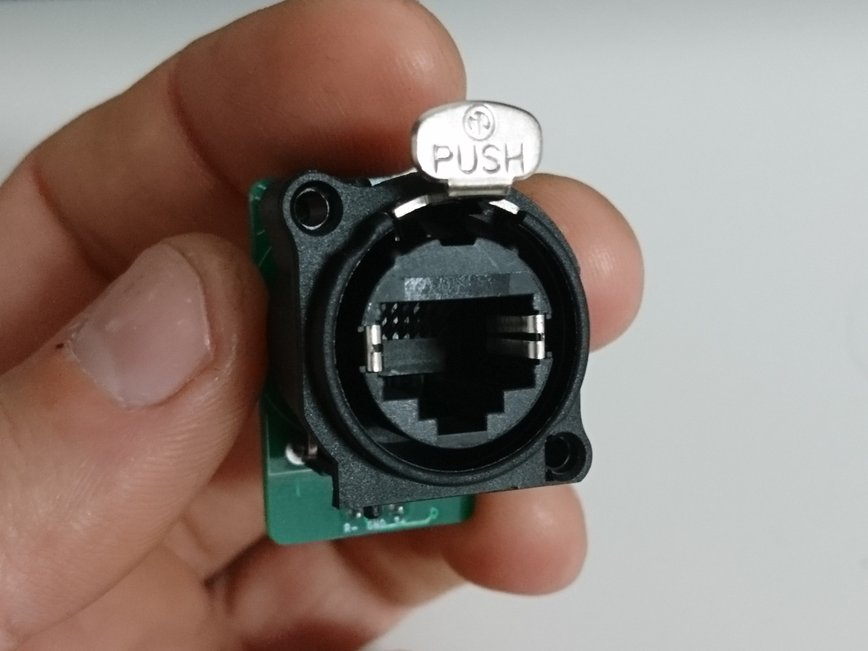
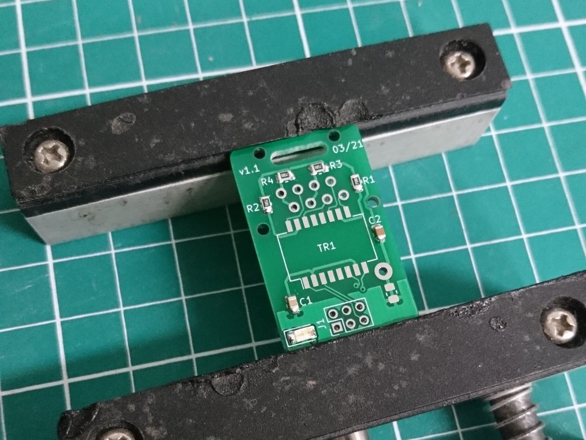
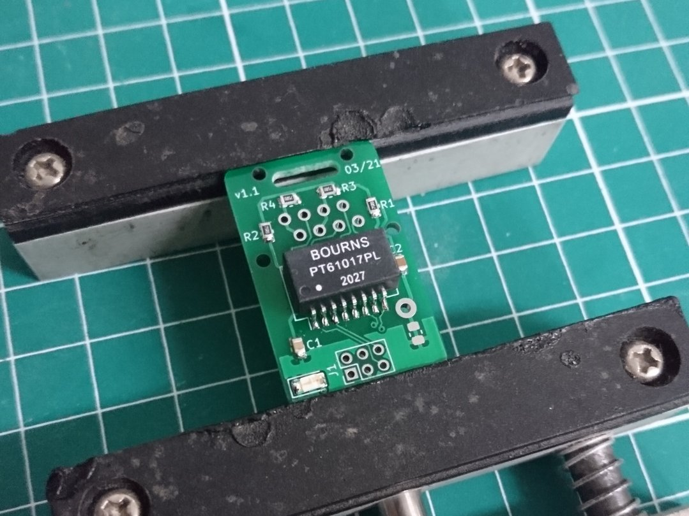
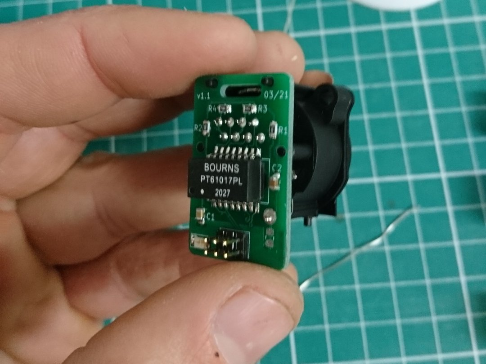
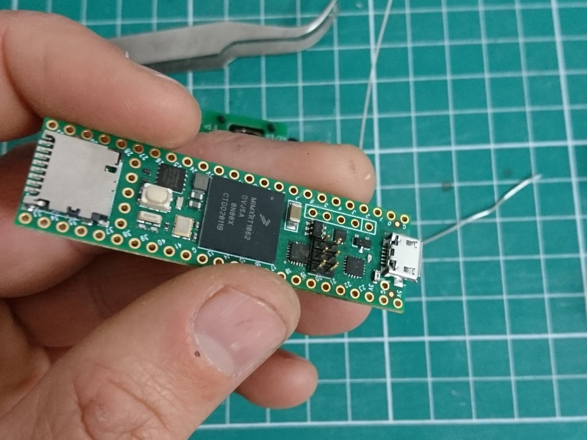
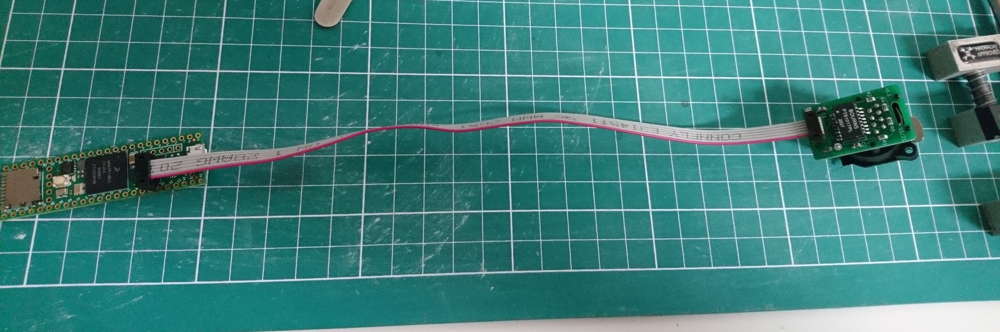

# Teensy 4.1 etherCON adapter

These are the design files to add a Neutrik etherCON Ethernet connector to your Teensy 4.1. It replaces the official [Ethernet kit for Teensy 4.1](https://www.pjrc.com/store/ethernet_kit.html) sold by PJRC and provides a panel-mountable, rugged Ethernet port to your Teensy.

## Get the PCB made

Order from OSHPark here : https://oshpark.com/shared_projects/l8queh8X

Or you can get the PCB made by the board house of your choice, just send them the .zip file in the `gerber` directory.

## Bill of materials

| Designator  | Qty | Value      | Package                                          | Farnell P/N | Mouser P/N        | Digikey P/N       |
|---|---|---|---|---|---|---|
| C1          |  1  | 0.1uF/50V  | C_0805_2012Metric                                | 3013478     | 581-08055C104K    | 1276-1003-1-ND    |
| C2          |  1  | 1000pF/2kV | C_0805_2012Metric                                |	2522440	    |	791-0805B102K102CT|	311-4341-1-ND     |
| D1          |  1  | LED        | LED_1206_3216Metric						                  |             |                   |                   |
| J1          |  2  | Conn_01x06 | PinHeader_2x03_P2mm_Vertical						          |             |                   |                   |
| J2          |  1  | NE8FAV     | Neutrik_EtherCON_NE8FAV_1x8P_GND_Female_Vertical	| 1202031	    |	568-NE8FAV        |                   |
| R4,R3,R2,R1 |  4  | 75R        | R_0805_2012Metric                                | 2671086	    |	652-CR0805JW-750ELF| RR12Q75DCT-ND    |
| TR1         |  1  | PT61017PEL | Transformer_Ethernet_Bourns_PT61017PEL           |             | 652-PT61017PEL    |	PT61017PELCT-ND   |

You will also need **1mm pitch** 6 conductors ribbon cable and 2 **2mm pitch** female IDC connectors to connect the Teensy and the etherCON adapter. 

## Assembly steps
Check out the html interactive BoM in the `bom` directory.

1. Solder the passive components. You don't need a stencil and solder paste, a soldering iron with fine tip is OK.

2. Solder the LAN magnetics. 

3. Solder the 2mm pin header and the etherCON jack

4. Solder a 2mm pin header to your Teensy 4.1

5. Connect the etherCON adapter to the Teensy with a ribbon cable (pay attention to the connector orientation)

Just like the Ethernet kit, you need to use the `NativeEthernet` library to use the integrated Ethernet port.

On the bottom right of the PCB, you can see an unused 0805 footprint (R5 in the design files). If you need (and you know better than me), you can cut the trace under the footprint and handle differently the Ethernet grounding.

6. Enjoy a panel mount, professionnal-looking Ethernet port for your Teensy!
